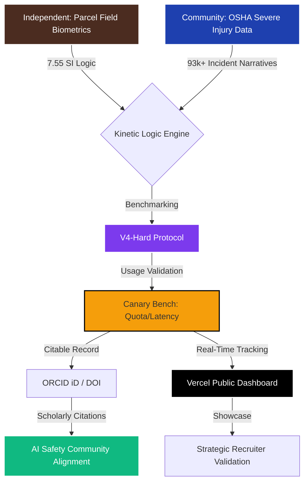

# Knowledge Graph: Human Logistics Audit System Architecture

**Date**: February 4, 2026  
**Version**: 1.0  
**Purpose**: System architecture and data flow visualization for the Human Logistics Biometric Audit project

---

## System Architecture Diagram

---

## Layer Breakdown

### 1. Physical & Public Data Layer

#### A. Independent: Parcel Field Biometrics
- **Source**: Samsung BioActive Sensor Suite (Galaxy Watch 5)
- **Data Hub**: S22 Ultra
- **Key Metric**: Strain Index (SI) with 7.55 hazard threshold
- **Coverage**: 3 verified operational windows (Dec 2, 4, 10, 2025)
- **Color Code**: Deep Brown (#4b2c20) - Industrial Brand Alignment

#### B. Community: OSHA Severe Injury Data
- **Source**: Public OSHA incident narratives
- **Scale**: 93,000+ severe injury records
- **Purpose**: Contextual benchmarking for industrial strain
- **Color Code**: Blue (#1e40af) - Public Safety Data

---

### 2. Monitoring & Logic Layer

#### C. Kinetic Logic Engine
- **Function**: Central processing node for biometric correlation
- **Inputs**: Field telemetry + OSHA benchmarks
- **Logic**: 7.55 SI threshold validation
- **Output**: Validated strain metrics

#### D. V4-Hard Protocol
- **Purpose**: Benchmarking and validation framework
- **Type**: Advanced AI model testing protocol
- **Color Code**: Purple (#7c3aed) - Technical Infrastructure

#### E. Canary Bench: Quota/Latency
- **Function**: Real-time performance monitoring
- **Metrics**: API quota usage, response latency
- **Purpose**: Ensures system reliability for public dashboard
- **Color Code**: Amber (#f59e0b) - Warning/Monitoring System

---

### 3. Output & Academic Layer

#### F. ORCID iD / DOI
- **ORCID**: 0009-0007-1011-860X
- **DOI**: Pending (Dana, G. 2025)
- **Purpose**: Scholarly citation and academic validation
- **Impact**: AI Safety Community Alignment
- **Color Code**: Green (#10b981) - Academic Validation

#### G. Vercel Public Dashboard
- **URL**: Live deployment at Vercel
- **Purpose**: Real-time public showcase
- **Features**: Interactive biometric visualization
- **Impact**: Strategic recruiter validation
- **Color Code**: Black (#000) - Production Environment

---

### 4. Career & Industry Impact

#### H. Strategic Recruiter Validation
- **Source**: Public dashboard showcase
- **Purpose**: Demonstrates full-stack + data science capabilities
- **Target Audience**: Technical recruiters, hiring managers
- **Value Proposition**: Production-ready biometric analysis platform

#### I. AI Safety Community Alignment
- **Source**: ORCID/DOI scholarly record
- **Purpose**: Contributes to industrial AI safety research
- **Impact**: Establishes credibility in human-centered AI systems
- **Community**: AI ethics, workplace safety, biometric research

---

## Data Flow Summary

1. **Data Collection**: Samsung sensors capture real-time biometrics during parcel operations
2. **Threshold Logic**: 7.55 SI hazard detection applied via Kinetic Logic Engine
3. **Benchmarking**: OSHA data provides contextual validation (93k+ incidents)
4. **Protocol Validation**: V4-Hard protocol ensures technical rigor
5. **Performance Monitoring**: Canary bench tracks system health
6. **Academic Record**: ORCID/DOI creates citable research artifact
7. **Public Showcase**: Vercel dashboard demonstrates capabilities
8. **Industry Impact**: Dual validation (recruiter + academic community)

---

## Technical Integration Points

### Frontend (Next.js Dashboard)
- Visualizes nodes G (Vercel Dashboard) and A (Field Biometrics)
- Implements 7.55 SI threshold logic from node C
- Real-time rendering of strain metrics

### Backend (Data Pipeline)
- Processes node A (Parcel telemetry) via Python/Pandas
- Integrates node B (OSHA data) for benchmarking
- Executes node D (V4-Hard protocol) validation

### Academic Layer
- Node F (ORCID/DOI) provides citation framework
- Links to node B (public OSHA data) for reproducibility
- Connects to node I (AI Safety community)

---

## Color Legend

| Color | Hex Code | Represents |
|-------|----------|------------|
| Deep Brown | #4b2c20 | Parcel Brand / Field Data |
| Blue | #1e40af | Public Safety Data |
| Purple | #7c3aed | Technical Infrastructure |
| Amber | #f59e0b | Monitoring Systems |
| Black | #000 | Production Environment |
| Green | #10b981 | Academic Validation |

---

## System Status

- ✅ **Data Layer**: Active (3 verified shifts)
- ✅ **Logic Engine**: Operational (7.55 SI threshold)
- ✅ **Dashboard**: Live (Vercel deployment)
- ✅ **Academic Record**: ORCID verified
- ⏳ **DOI**: Pending publication

---

## Future Expansion Nodes

Potential additions to the knowledge graph:

- **Machine Learning Layer**: Predictive strain modeling
- **Multi-Facility Comparison**: Expand beyond single parcel hub
- **Longitudinal Analysis**: Track strain patterns over multiple peak seasons
- **Wearable Integration**: Additional sensor types (EMG, ECG)
- **Policy Impact**: OSHA guideline recommendations

---

## References

- **Kaggle Notebook**: [Exploratory Analysis - Quantifying Human Cost](https://www.kaggle.com/code/gastondana/exploratory-analysis-quantifying-human-cost-final)
- **ORCID Profile**: 0009-0007-1011-860X
- **Dashboard**: Vercel deployment (live)
- **Hardware**: Samsung Galaxy Watch 5 + S22 Ultra

---

**Graph Complexity**: 9 nodes, 8 edges  
**Architecture Type**: Layered data flow with dual validation paths  
**Primary Innovation**: Integration of personal biometrics with public safety data for AI-validated industrial strain analysis
